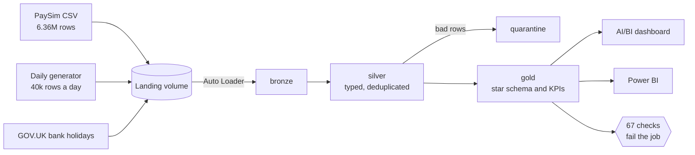

# Payments Fraud-Monitoring Lakehouse


An end-to-end data engineering project on **Databricks**: it ingests payment transactions
incrementally, cleans and validates them, models them as a star schema, and answers fraud
monitoring questions. It uses the public [PaySim](https://www.kaggle.com/datasets/ealaxi/paysim1)
dataset (synthetic mobile-money transactions with fraud labels), a Python generator that
produces new daily transaction files, and a UK bank-holiday reference API.

> **Status: complete (phases 0 to 7).** A scheduled Databricks job lands, cleans, models and checks a
> day of data every morning at 06:00 London. Reading guide for reviewers: start with the
> [architecture](docs/architecture.md), then the [decisions](docs/decisions.md).

## What it shows

| Skill | Where to look |
|---|---|
| Incremental ingestion (Auto Loader, schema evolution, late files) | `pipelines/bronze/`, ADR-009 to ADR-012 |
| Medallion modelling with quality gates | `pipelines/silver/` (expectations, quarantine, dedup), [silver.md](docs/silver.md) |
| Star schema with SCD Type 2 and point-in-time joins | `pipelines/gold/`, [data_model.md](docs/data_model.md), ADR-017 to ADR-020 |
| Reconciliation that fails the run | `sql/checks/` (67 checks) and the `reconciliation` view in gold |
| Orchestration, alerting, idempotency | `resources/daily.job.yml`, [runbook](docs/runbook.md), ADR-021 to ADR-024 |
| Deployment as code | Databricks Asset Bundle: pipeline, job and dashboard in `resources/` |
| Testing | About 430 tests: the pipeline SQL runs in local Spark, plus pytest for the Python, 99% coverage, three CI jobs ([ADR-025](docs/decisions.md)) |
| Data quality history | `workspace.quality`, [data_quality.md](docs/data_quality.md) |
| Reporting | AI/BI dashboard from code, Power BI model and DAX, [reporting.md](docs/reporting.md) |

## Questions it answers

- Daily transaction volume, value, approval and fraud rates
- Fraud by transaction type, amount band and time of day
- Customers and merchants with unusual activity (rule-based flags)
- How good simple fraud rules are (precision and recall)
- Reconciliation: do the totals in gold match the raw source? (the run fails if not)

Definitions and the caveats a reader needs are in [docs/kpis.md](docs/kpis.md).

## Architecture



Full diagrams, including the daily job, are in [docs/architecture.md](docs/architecture.md).

## Results (verified on Databricks Free Edition)

- 7.0 million transactions in the fact table (PaySim plus 17 generated days), one row per `event_id`,
  each loaded exactly once however many times the job reruns (content fingerprints before and after a
  full refresh were identical across all 19 tables).
- A normal daily run takes about 8 minutes end to end (docs/architecture.md).
- 67 reconciliation checks, 54 pipeline expectations, all passing, with the history kept in
  `workspace.quality`.
- 7,480 rows are quarantined with a reason code and the original values, not dropped. 17 fraud events
  were among them at the first check (see the runbook).
- Tests found three real defects in the silver SQL before they could matter (ADR-025).

The data is synthetic, so these findings describe the pipeline and not real fraud.

## Tech stack

Databricks Free Edition · Unity Catalog · Delta Lake · Lakeflow Spark Declarative Pipelines ·
Auto Loader · SQL and PySpark · Databricks Asset Bundles · AI/BI dashboards · Power BI ·
Python 3.12 with `uv` · pytest and local Spark · ruff and sqlfluff with pre-commit · GitHub Actions

## Repository layout

| Folder | Purpose |
|---|---|
| `src/` | Tested Python: the generator, the holiday client, the check runner, the identifier guard |
| `pipelines/` | Lakeflow pipeline code for bronze, silver and gold |
| `sql/` | Setup, the reconciliation suites (`checks/`) and the quality history setup (`quality/`) |
| `resources/` | Asset Bundle: the pipeline, the daily job and the dashboard |
| `dashboards/` | The script that builds the dashboard JSON, and the JSON |
| `tests/` | pytest, including the SQL tests that run in local Spark |
| `docs/` | Architecture, data model, KPIs, quality, reporting, setup, runbook, [Airflow comparison](docs/airflow.md), decisions |

## Run it yourself

Setup is in [docs/setup.md](docs/setup.md) (a free Databricks workspace and a Mac or Linux shell).

```bash
uv sync                                       # pinned dependencies
uv run pytest -m "not sql"                    # fast tests
uv run pytest -m sql                          # pipeline SQL in local Spark (needs Java 17)
uv run pre-commit run --all-files             # the same lint as CI
databricks bundle validate --strict -t dev    # check the bundle
databricks bundle deploy -t dev               # deploys; the daily schedule goes live
```

## Data and attribution

- Transactions come from the [PaySim dataset](https://www.kaggle.com/datasets/ealaxi/paysim1) by
  Edgar Lopez-Rojas, licensed **CC BY-SA 4.0**. Please cite: E. A. Lopez-Rojas, A. Elmir and
  S. Axelsson, "PaySim: A financial mobile money simulator for fraud detection", 28th European
  Modeling and Simulation Symposium (EMSS), Larnaca, Cyprus, 2016. The data is **not** stored in
  this repository.
- Bank holiday dates come from the [GOV.UK bank holidays API](https://www.gov.uk/bank-holidays.json).
  Contains public sector information licensed under the
  [Open Government Licence v3.0](https://www.nationalarchives.gov.uk/doc/open-government-licence/version/3/).
  (GOV.UK states most of its content is under that licence; the JSON file itself carries no
  statement, so this is the licence of the site that publishes it.)
- Everything else is synthetic data produced by this project's generator. What was found in the data,
  and how it shapes the pipeline, is in [docs/data_profile.md](docs/data_profile.md).

## Roadmap

- [x] Phase 0: tooling and workspace setup
- [x] Phase 1: repo skeleton, pre-commit, CI
- [x] Phase 2: bronze (PaySim, generator, API, Auto Loader)
- [x] Phase 3: silver (typing, dedup, expectations, quarantine)
- [x] Phase 4: gold (star schema, SCD2, KPIs, reconciliation)
- [x] Phase 5: automation (scheduled job, alerts, Asset Bundle, idempotency)
- [x] Phase 6: quality (tests, CI, data quality summary)
- [x] Phase 7: reporting (dashboard, Power BI guide, final README)
