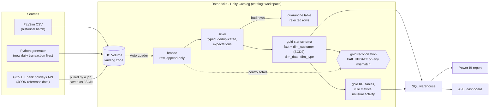
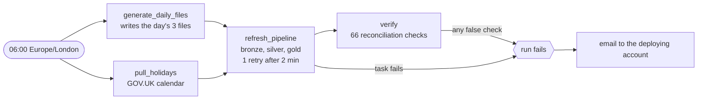

# Architecture

> **Status:** the landing zone, bronze, silver and gold are built and verified (Phase 2: four
> sources, incremental and schema-change runs; Phase 3: unified, deduplicated and quarantined
> transactions, see [silver.md](silver.md); Phase 4: a star schema with an SCD2 customer dimension,
> KPI tables and a reconciliation that fails the run, see [data_model.md](data_model.md) and
> [kpis.md](kpis.md)). Phase 5 added the daily job, its failure alerts and the deploy-as-code bundle
> (see below and [airflow.md](airflow.md)). 66 checks pass on every run. The BI layer is still planned.
> Updated at the end of each phase.

## Data flow

## The daily job

Operations around the flow:

- **Orchestration:** one scheduled Databricks Job, `payments_lakehouse_daily` (ADR-021). It runs every
  day at 06:00 London, one run at a time, in about 8 minutes. It is deployed as code with a Databricks
  Asset Bundle: a `dev` target that is deployed and a `prod` target that is defined and validated only
  (ADR-007).
- **Alerting:** an email goes to the deploying account when a run fails, and when a run passes 30
  minutes (ADR-022). Tested end to end on 2026-10-04.
- **Safe to rerun:** every step is idempotent, so a repair or a second run changes nothing (ADR-023).
- **CI:** GitHub Actions runs lint (ruff, sqlfluff) and pytest on every push.

## Layers and what each one guarantees

| Layer | Guarantee | Typical operations |
|---|---|---|
| **Landing (volume)** | Files exactly as received. Never modified. | Drop files from each source |
| **Bronze** | Raw data as Delta tables, append-only, plus audit columns (source file, ingest time). Replayable. | Auto Loader ingestion, no business logic |
| **Silver** | Typed, deduplicated, validated. Every row passed its expectations, or sits in quarantine with the reason. | Cleaning, joins to reference data, expectations |
| **Gold** | Business-ready star schema and KPI tables, reconciled to the raw source. | Dimensional modelling, aggregates |

## Principles the design follows

1. **Incremental:** only new files are processed each run (Auto Loader checkpoints).
2. **Idempotent:** rerunning a job never creates duplicates or changes results.
3. **Quality gates:** bad rows are quarantined, and a reconciliation mismatch fails the run.
4. **Everything as code:** pipelines, jobs and config live in Git and deploy via a bundle.

See [decisions.md](decisions.md) for the reasoning behind each choice.
