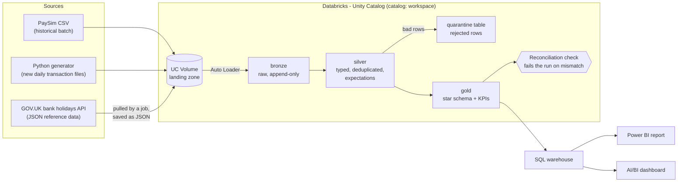

# Architecture

> **Status: planned design.** Updated at the end of each phase. Nothing below is built until
> the README roadmap says so.

## Data flow

Operations around the flow:

- **Orchestration:** a scheduled Databricks Job runs the pipeline. It is deployed as code with
  a Databricks Asset Bundle, and a failure sends an email alert.
- **CI:** GitHub Actions runs lint (ruff, sqlfluff) and pytest on every push.

## Layers and what each one guarantees

| Layer | Guarantee | Typical operations |
|---|---|---|
| **Landing (volume)** | Files exactly as received. Never modified. | Drop files from each source |
| **Bronze** | Raw data as Delta tables, append-only, plus audit columns (source file, ingest time). Replayable. | Auto Loader ingestion, no business logic |
| **Silver** | Typed, deduplicated, validated. Every row passed its expectations, or sits in quarantine with the reason. | Cleaning, joins to reference data, expectations |
| **Gold** | Business-ready star schema and KPI tables, reconciled to the raw source. | Dimensional modelling, aggregates |

## Principles the design follows

1. **Incremental:** only new files are processed each run (Auto Loader checkpoints).
2. **Idempotent:** rerunning a job never creates duplicates or changes results.
3. **Quality gates:** bad rows are quarantined, and a reconciliation mismatch fails the run.
4. **Everything as code:** pipelines, jobs and config live in Git and deploy via a bundle.

See [decisions.md](decisions.md) for the reasoning behind each choice.
