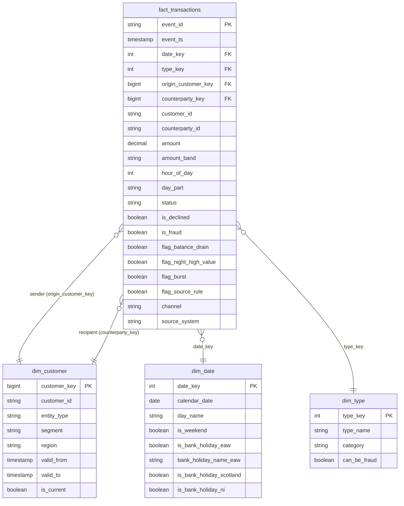

# Data model

The gold layer is a star schema in `workspace.gold`: one fact table surrounded by three
dimensions, plus serving tables for KPIs (see [kpis.md](kpis.md)). Built in Phase 4 and verified
against bronze, silver and the landing files.

## Source: PaySim (profiled on the real file, see [data_profile.md](data_profile.md))

One row per simulated mobile-money transaction. Columns: `step`, `type`, `amount`, `nameOrig`,
`oldbalanceOrg`, `newbalanceOrig`, `nameDest`, `oldbalanceDest`, `newbalanceDest`, `isFraud`,
`isFlaggedFraud`. 6,362,620 rows over 31 simulated days (`step` 1 to 743, one step is one hour).
Transaction types: `CASH_IN`, `CASH_OUT`, `DEBIT`, `PAYMENT`, `TRANSFER`.

## Star schema

**Grain of the fact table: one row per transaction (`event_id`).**

The diagram shows the main columns; the tables have a few more (balances, status provenance,
`amount_band_sort`, `is_zero_amount`, calendar parts).

### Facts about the model

| Table | Rows (16 generated days, 20 Sep to 5 Oct) | Notes |
|---|---|---|
| `fact_transactions` | 6,995,580 | PaySim 6,362,620 plus 632,960 generated |
| `dim_customer` | 69,880 | 69,879 versions plus the Unknown member; 65,001 are current |
| `dim_date` | 365 | The calendar year 2026 |
| `dim_type` | 5 | One row per transaction type |

### Design decisions that matter

- **SCD Type 2 customers (ADR-019).** A new version is created when a customer's `segment` or `region`
  changes. A version is valid over the half-open range `[valid_from, valid_to)`, and the current
  version ends at 9999-12-31. The fact stores the key of the version valid **at event time**, for
  the sender and for the recipient (a role-playing dimension).
- **Late-arriving changes.** If a change event arrives after transactions it affects were loaded,
  the dimension re-cuts its history and the fact, a materialized view, re-points the affected rows.
  Tested: 173 sender keys and 98 recipient keys moved, and nothing else did.
- **Unknown member (ADR-006, ADR-017).** PaySim has no customer master data, so its IDs map to
  `customer_key = -1`. The raw IDs stay on the fact, so they can still be analysed.
- **Surrogate keys are deterministic hashes** of the business key and version start, because a
  materialized view cannot use identity columns and a hash is stable across rebuilds.
- **Rule flags on the fact** (ADR-020): balance drain, night-time high-value transfer, burst, and
  the source's own rule. They are measured against the fraud label in `rule_effectiveness`.
- **Layout (ADR-018):** liquid clustering on `(date_key, type_key)`, no partitioning.

### Data quality guarantees on gold

Every key resolves (no orphans), every event is in the fact once, the fact adds up to the KPI
tables, and the totals equal bronze and the landing files to the cent. The in-pipeline
`reconciliation` view fails the update if any of that stops being true.

## Questions that were open in Phase 1, now resolved

1. **Customer attributes:** a change-event feed builds the SCD2 dimension (ADR-006, ADR-019).
2. **Approved or declined status:** derived for PaySim, supplied by the generator (ADR-005).
3. **Physical layout:** liquid clustering, backed by a measurement (ADR-018).
