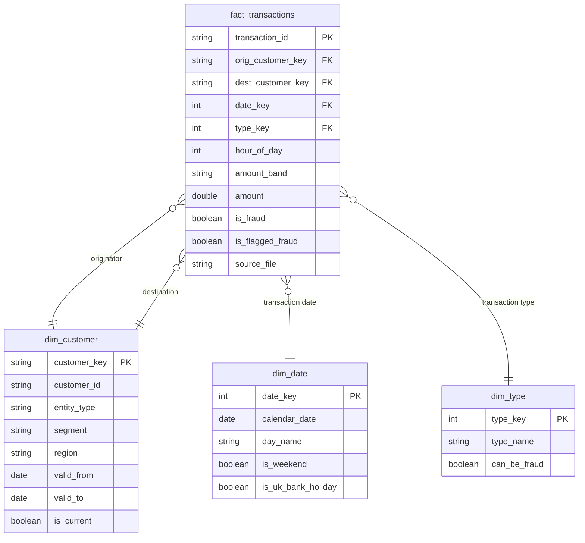

# Data model

> **Status: draft, to be finalised in Phase 4.** This records the intended gold star schema.

## Source: PaySim (profiled on the real file, see [data_profile.md](data_profile.md))

One row per simulated mobile-money transaction. Columns: `step`, `type`, `amount`, `nameOrig`,
`oldbalanceOrg`, `newbalanceOrig`, `nameDest`, `oldbalanceDest`, `newbalanceDest`, `isFraud`,
`isFlaggedFraud`. 6,362,620 rows over 31 simulated days (`step` 1 to 743, one step is one hour).
Transaction types: `CASH_IN`, `CASH_OUT`, `DEBIT`, `PAYMENT`, `TRANSFER`.

## Gold star schema (draft)

**Grain of the fact table: one row per transaction.**

- **`dim_customer` is SCD Type 2:** when a customer's attributes change, the old row is closed
  (`valid_to`, `is_current = false`) and a new row is opened, so history stays correct.
  `entity_type` distinguishes customers from merchants.
- **Originator and destination both point at `dim_customer`** (a role-playing dimension).
- **`dim_date.is_uk_bank_holiday`** comes from the GOV.UK bank holidays API.

## Resolved and open questions

1. **Customer attributes (decided, ADR-006).** PaySim has none, so the generator emits a customer
   change-event feed that builds the SCD2 dimension. **Still open:** the population size. Covering
   every PaySim ID means about 9.07M members (6,923,499 customers and 2,150,401 merchants), and the
   alternative is a bounded subset. We decide at the generator step.
2. **Approved or declined status (decided, ADR-005).** Derived for PaySim from `isFlaggedFraud`
   (16 rows, so the rate is almost constant) and supplied by the generator for new days.
3. **Physical layout:** the gold fact table will be partitioned or clustered, but for a table
   of this size the choice (liquid clustering vs partitioning) is to be confirmed against the
   Databricks documentation and measured in Phase 4.

## Planned KPIs

Daily volume, value, approval rate and fraud rate; fraud by type, amount band and hour of day;
customers and merchants with unusual activity (rule-based flags); reconciliation of gold totals
to raw.
