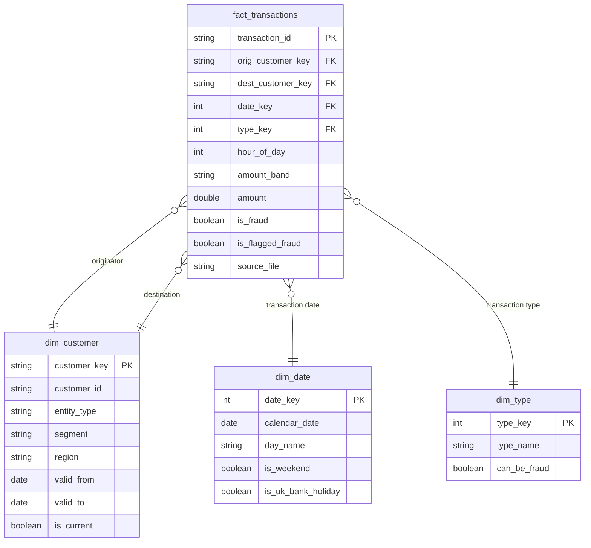

# Data model

> **Status: draft, to be finalised in Phase 4.** This records the intended gold star schema.

## Source: PaySim (to be verified when loaded in Phase 2)

One row per simulated mobile-money transaction. Columns: `step`, `type`, `amount`, `nameOrig`,
`oldbalanceOrg`, `newbalanceOrig`, `nameDest`, `oldbalanceDest`, `newbalanceDest`, `isFraud`,
`isFlaggedFraud`. Roughly 6.36 million rows over 30 simulated days, where one `step` is one
hour. Transaction types: `CASH_IN`, `CASH_OUT`, `DEBIT`, `PAYMENT`, `TRANSFER`.

## Gold star schema (draft)

**Grain of the fact table: one row per transaction.**

- **`dim_customer` is SCD Type 2:** when a customer's attributes change, the old row is closed
  (`valid_to`, `is_current = false`) and a new row is opened, so history stays correct.
  `entity_type` distinguishes customers from merchants.
- **Originator and destination both point at `dim_customer`** (a role-playing dimension).
- **`dim_date.is_uk_bank_holiday`** comes from the GOV.UK bank holidays API.

## Open questions to resolve (decide with the user in Phase 2/3)

1. **PaySim has no customer attributes**, so there is nothing to change over time and SCD2
   would be artificial. Proposal: the generator also emits a customer profile feed (segment,
   region) whose values change, so SCD2 is genuine.
2. **PaySim has no approved/declined status**, yet we want an approval rate. Options: the
   generator adds a `status` field for new data, or we define approval from `isFlaggedFraud`.
   Either way the definition must be written down here.
3. **Physical layout:** the gold fact table will be partitioned or clustered, but for a table
   of this size the choice (liquid clustering vs partitioning) is to be confirmed against the
   Databricks documentation and measured in Phase 4.

## Planned KPIs

Daily volume, value, approval rate and fraud rate; fraud by type, amount band and hour of day;
customers and merchants with unusual activity (rule-based flags); reconciliation of gold totals
to raw.
