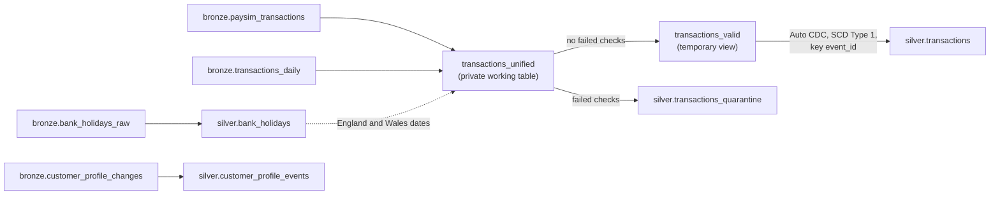

# Silver layer

Silver turns raw bronze into data everything downstream can trust: one schema for every source,
correct types, one row per event, and every rejected row kept with the reason it was rejected.
Code: `pipelines/silver/`. Checks: `sql/checks/silver_reconciliation.sql`. Decisions: ADR-013 to
ADR-015.

## Tables

| Table | Rows (15 days loaded) | What it holds |
|---|---|---|
| `silver.transactions` | 6,956,020 | Clean, deduplicated transactions from PaySim and the generator, one row per `event_id` |
| `silver.transactions_quarantine` | 6,600 | Every rejected row, with its reason codes and original values as JSON |
| `silver.customer_profile_events` | 69,550 | Typed change events, the source for the SCD2 dimension in Phase 4 |
| `silver.bank_holidays` | 280 | The GOV.UK payload parsed to one row per region and date |

## One schema for two sources

| Column | PaySim | Generated feed |
|---|---|---|
| `event_id` | `P` plus 24 hex characters of a hash of every column (the file has no duplicate rows) | from the source |
| `event_ts` | `step` counted in hours from 2026-08-20 00:00 (ADR-008) | parsed from text |
| `status`, `status_source` | derived: `DECLINED` if `isFlaggedFraud`, else `APPROVED`; `derived_paysim_rule` (ADR-005) | from the source; `source_system` |
| `dest_balance_*` | NULL for a merchant recipient (the file's 0 means unknown) | NULL (not in the feed) |
| `is_zero_amount` | 16 rows, flagged and kept | flagged |
| `is_bank_holiday` | England and Wales, from `silver.bank_holidays` (ADR-015) | same |

## Reason codes in quarantine

| Code | Rule | Injected per day | Verified total (15 days) |
|---|---|---|---|
| `NULL_REQUIRED_FIELD` | `customer_id`, `amount`, `type` or `event_ts` is null | 200 | 3,000 |
| `NEGATIVE_AMOUNT` | `amount < 0` | 120 | 1,800 |
| `UNKNOWN_TYPE` | type is not one of the five known types | 80 | 1,200 |
| `BAD_TIMESTAMP` | the text does not parse as a timestamp | 40 | 600 |

Each row gets exactly one reason, so each count reconciles with the generator manifests. Duplicates
are removed, not quarantined: a duplicate is not a defect in the data.

## Expectations (21)

| Table | Hard (`FAIL UPDATE`) | Soft (measured) |
|---|---|---|
| `silver.transactions` | `event_id_present`, `event_ts_present`, `customer_present`, `amount_not_negative`, `known_type`, `known_status` | `decline_has_reason`, `counterparty_present`, `event_date_in_range` |
| `silver.transactions_quarantine` | `has_reason` | `has_event_id`, `has_raw_record` |
| `silver.customer_profile_events` | `customer_id_present`, `changed_at_present` | `known_entity_type`, `id_prefix_matches_type`, `segment_present`, `region_present` |
| `silver.bank_holidays` | `holiday_date_present`, `known_division` | `title_present` |

The hard rules on `silver.transactions` are a safety net behind the split: if the split logic ever
let a bad row through, the update fails instead of letting it reach gold. On the first run every
expectation passed with 0 failures.

## What quarantine costs, and how to repair

Quarantine is not a bin. On the 14 days checked first, **17 fraud events** (1.0% of the generated
fraud) were in quarantine, because they also carried a defect, so fraud KPIs exclude them until
repaired. To repair a row, correct it at the source and send it as a new file: its `event_id` is
unchanged, so the Auto CDC upsert adds it to `silver.transactions`. The quarantined copy stays as an
audit record (quarantine is append-only and not deduplicated).

## Replayability

Every table was rebuilt from the landing files with a full refresh in 1 min 45 s. All eight tables
came back with identical rows and identical business-column fingerprints, and all 43 reconciliation
checks passed again (ADR-016).
